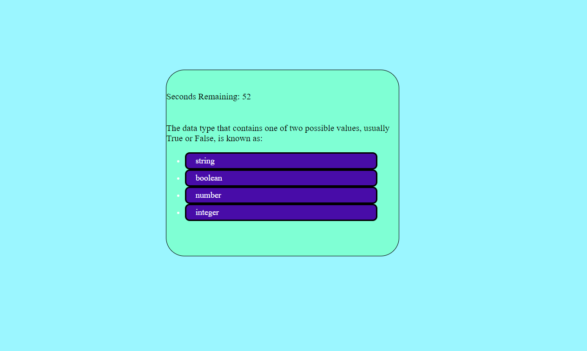
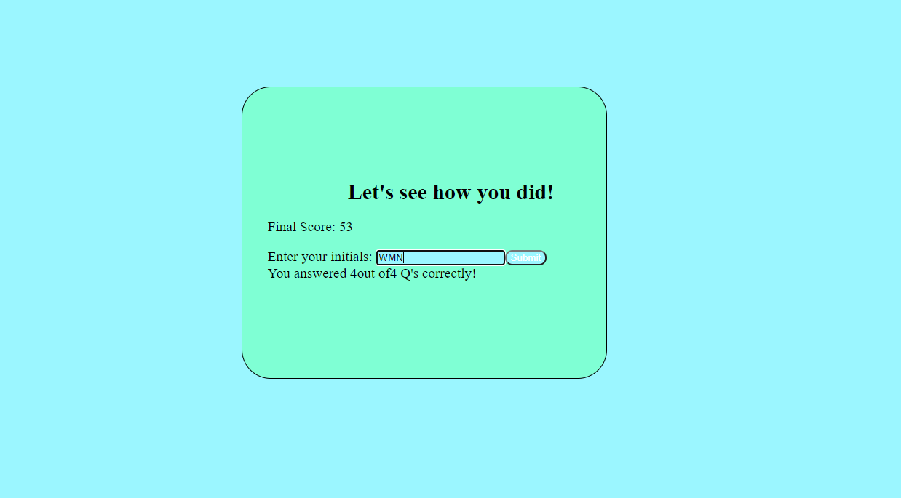
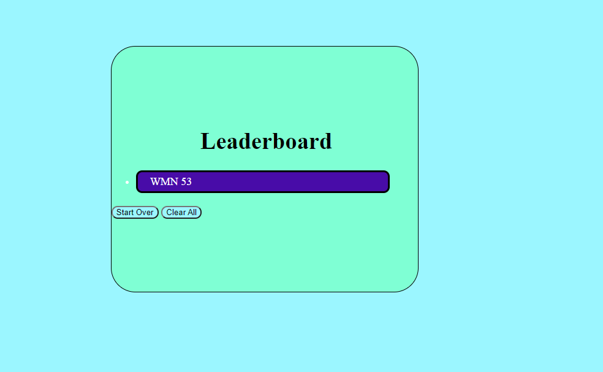

# 02 Advanced CSS: Portfolio

## Description

This is an interactive quiz with four total multiple choice questions. Upon clicking the start button, 
a 60-second timer initiates and the first question is presented. If a question is answered incorrectly, 
10 seconds are deducted from however many seconds are remaining on the clock. The user's "final score"
is whatever amount of time is remaining on the clock, incentivizing the user to not only answer 
accurately, but quickly as well. 

### Features

The user is able to log their score onto the leaderboard 
(local storage) by entering their initials into a textbox and submitting. The user also has
the option to clear all past high scores, and start the quiz over after submitting their scores.

### Visuals

### Links
[deployedApplication] https://will98nicholson.github.io/hw2/

